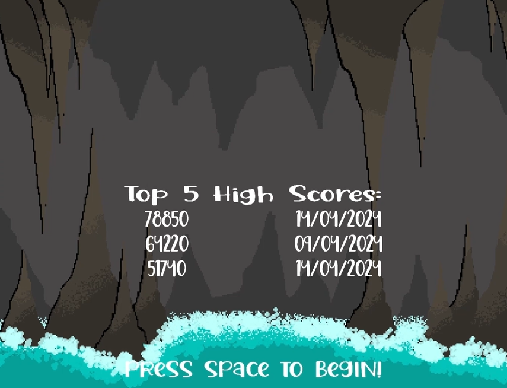

# SDL-Platformer-Game
An endless platformer game, where the player must reach the end of autoscrolling, randomly generated and increasingly difficult levels.

The game features additional coins and bonus items to collect during each level, which will increase the player's score. Additionally, collecting all 3 bonus items will reward the player
with an extra life! Furthermore, checkpoints appear during the level, which the player will revert to should they fall or collide with an obstacle. 

Level generation is initially tested to be achievable by the player, however coins, collectables and obstacle generation is not put under any feasability constraints - so this can cause some issues.

This game is largely based upon Stardew Valley's arcade game "Junimo Kart", and more specifically its endless mode. This was made for my c++ programming project during my first year at uni.

Linked below (click on the image) is a YouTube upload of gameplay
footage from this project. 

if that doesnt work, you can visit it through this link instead:
https://youtu.be/RQtewUR1yzQ.

